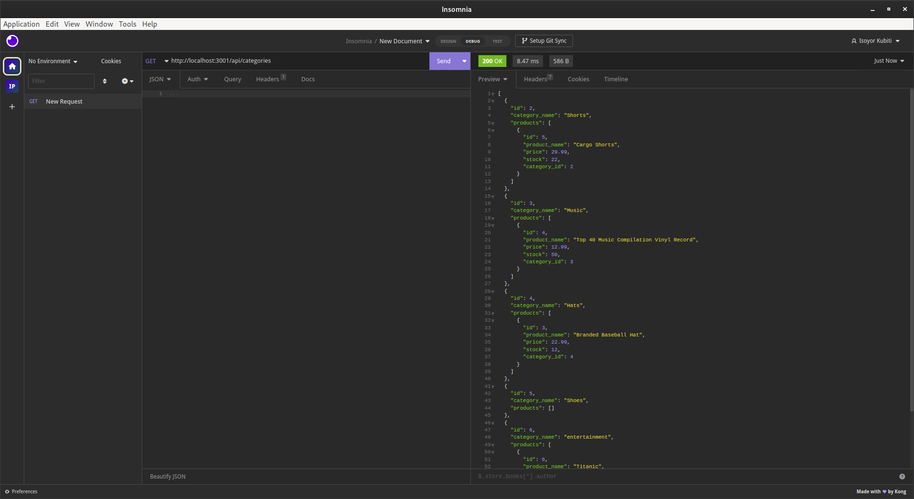
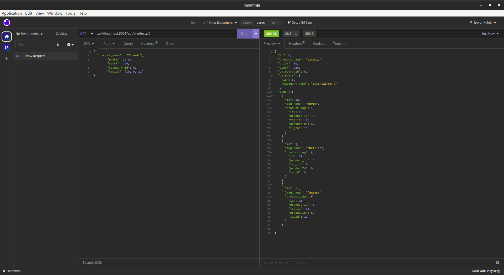
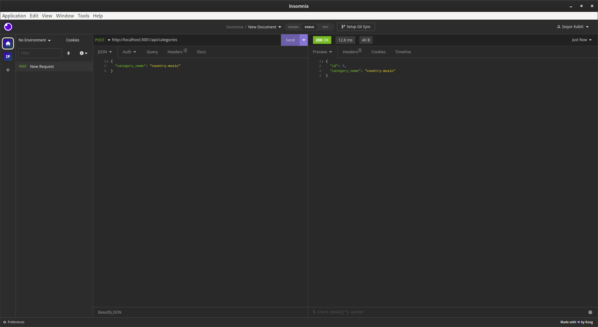
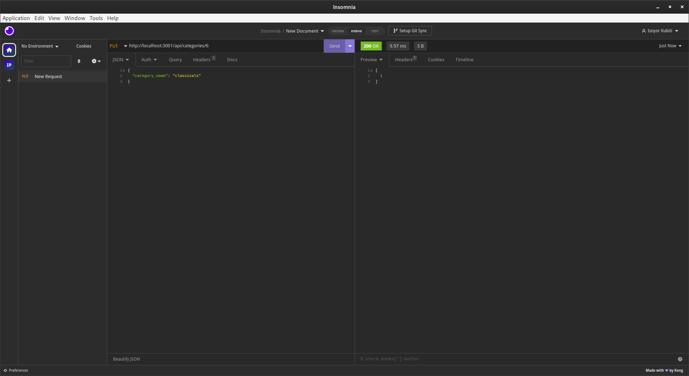
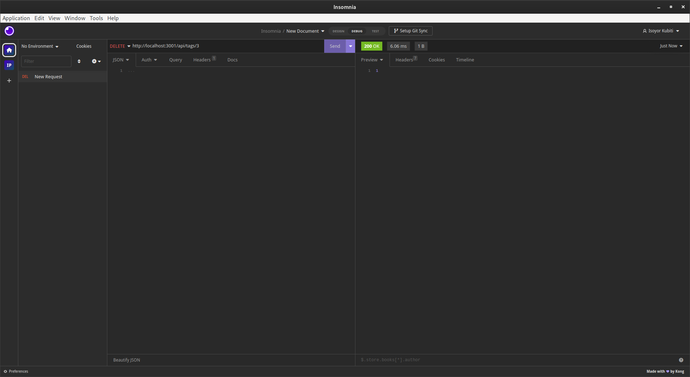

# ORM-ECOMMERCE-BACKEND APPLICATION

     

## Description

This application is a Node.js application that uses MySQL, Sequelize, dotenv, and Express to create the back end for an E-Commerce web page. It allows the manager to to modify the company's inventory by adding, deleting, updating, and reading any products data, their tags, or categories through Insomnia. It enables the manager to manage their company's inventory.

My objectives for this application is based on the following user story and acceptance criteria;

### User Story

```
As a manager at an internet retail company
I want a back end for my e-commerce website that uses the latest technologies
So that my company can compete with other e-commerce companies.

```

### Acceptance Criteria

```
Given a functional Express.js API

When I add my database name, MySQL username, and MySQL password to an environment variable file
Then I am able to connect to a database using Sequelize
When I enter schema and seed commands
Then a development database is created and is seeded with test data
When I enter the command to invoke the application
Then my server is started and the Sequelize models are synced to the MySQL database
When I open API GET routes in Insomnia for categories, products, or tags
Then the data for each of these routes is displayed in a formatted JSON
When I test API POST, PUT, and DELETE routes in Insomnia
Then I am able to successfully create, update, and delete data in my database

```

## Table of Contents

- [Description](#description)
- [Installation](#installation)
- [Usage](#usage)
- [Questions](#questions)
- [License](#license)

---

## Installation

To run this command-line application, you will need to install Node.js and once installed, you will run the following command in the root directory of the application:

- npm install

This command will install all dependencies found in the package.json file required by the application to execute. Once installed, you will navigate to the ./db directory and connect to the MySQL server using your username and password. Once connected, you will create your database with the command below and exit:

- source schema.sql; quit;

With the database created, you can connect to the database using your credentials stored in the environment variable file and use Sequelize to seed the database with the command below in the application's root directory;

- npm run seed

With the database seeded, you are ready to invoke the application.

## Usage

The [ORM E-Commerce Backend application](https://drive.google.com/file/d/1DcUpgSonXNMc-Y9ahrxGmf5zugK-cYvC/view?usp=share_link) is invoked by using the following command in the root directory of the application:

- npm run start

The link to a demonstration video showing how to setup and run the ORM E-Commerce Backend application is provided here: [ORM E-Commerce Backend Application Video](https://drive.google.com/file/d/1DcUpgSonXNMc-Y9ahrxGmf5zugK-cYvC/view?usp=share_link).

The images below shows some of the application's responses and feedback.

In Insomnia, the user can send a GET API request to retrieve all records for categories, tags, and products. The API returns the stored records with their associated data when available.




The user can also request for a specific record by providing the id of the record in categories, tags, or products.



The user can send a POST API request to create new data for categories, tags, and products. The POST API request must include the appropriate parameters for each model's attributes for successful creation. The POST request returns a JSON object containing the newly created record(s).



The user can update any existing record by send a PUT API request. The request must include the id and updated values for the corresponding attributes in the target model.



The user can delete any existing category by send a DELETE API request together with the id of the target record in the target model.



## Questions

If you have any questions, please feel free to reach out to me at: [ikubiti@icloud.com](mailto:ikubiti@icloud.com).

Alternatively, you may find me on GitHub at [https://github.com/ikubiti](https://github.com/ikubiti).

---

## License

Copyright (c) ikubiti. All rights reserved.

Licensed under the [MIT](./LICENSE) license.

